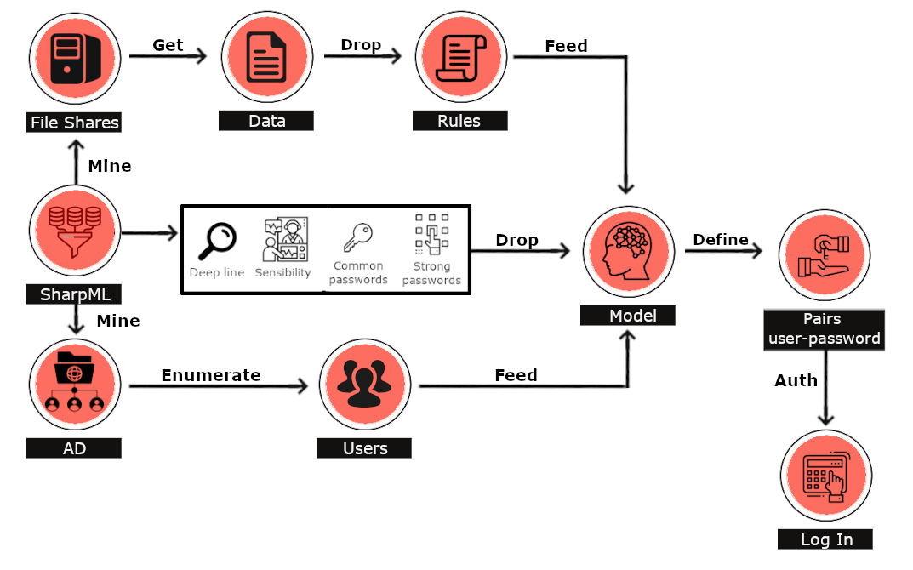

# SharpML


SharpML is a proof of concept file share data mining tool using Machine Learning in Python and C#.

The tool is discussed in more detail on our blog [here](https://blog.hunniccyber.com/password-hunting-with-ml-in-active-directory/index.html), but is summarised below also:

SharpML is C# and Python based tool that performs a number of operations with a view to mining file shares, querying Active Directory for users, dropping an ML model and associated rules, perfoming Active Directory authentication checks, with a view to automating the process of hunting for passwords in file shares by feeding the mined data into the ML model.

The ML model is written in Python, and has been developed using a custom algorithm to identify likelyhoods of passwords. The model has been compiled with PyInstaller and sits as resource file in the C# wrapper, which interops between itself, the data and the model. The program logic can be seen below:



Currently it allows for a single file share to be assessed.

You will need to have read access to the file share you are targeting, after which the tool will perform its activities mostly autonomously.

There a compiled release in the release section, and it is to be noted that this tool is currently a PoC and subject to numerous improvements.

## Usage:

cmd.exe
```
C:\> SharpML.exe -u \\fileshare\d$
```

Cobalt Strike

```
> execute-assembly SharpML.exe -u \\fileshare\d$
```

## Authors

Marco Valentini

Tom Kallo

## To Do

- When SharpML is run it will attempt to verify all users that it finds. If a restrictive domain lockout policy exits, it may attempt to verify users multiple times and lock the account out in event of multiple failed authentications
- Some file size limitations need to be implemented in order for larger text based files not to cause a bottle neck when copying the raw data
- Select the option of running multiple file shares simultaneously. By implementing an automatic share finder, allow SharpML to be completely autonomous and scour the whole network
- Improve some program logic, including further options such as the choice of cehcking against 10,000 most common passwords or not
